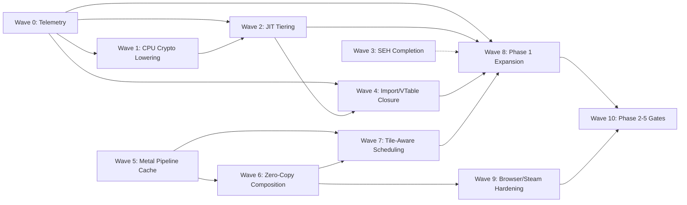

# Casa1 Execution Plan — Ordered Waves to 100% Compatibility

> **Derived from**: [`plans/compatibility_roadmap.md`](plans/compatibility_roadmap.md)
> **Status**: Planning document — pre-implementation baseline recorded May 2026
> **Focus**: Track A (Apple Silicon Efficiency) + Phase 1 (Foundation → 70%) as highest-priority execution waves

---

## Table of Contents

1. [Current State Baseline](#1-current-state-baseline)
2. [Dependency Map Across All Items](#2-dependency-map-across-all-items)
3. [Prioritization Rationale](#3-prioritization-rationale)
4. [Execution Waves](#4-execution-waves)
   - [Wave 0: Foundation Diagnostics & Telemetry](#wave-0-foundation-diagnostics--telemetry)
   - [Wave 1: CPU Core — Crypto Lowering & Feature Honesty](#wave-1-cpu-core--crypto-lowering--feature-honesty)
   - [Wave 2: JIT Tiering — Hot-Path Performance](#wave-2-jit-tiering--hot-path-performance)
   - [Wave 3: Exception Handling — SEH/VEH Completion](#wave-3-exception-handling--sehveh-completion)
   - [Wave 4: PE Runtime — Import/VTable Closure](#wave-4-pe-runtime--importvtable-closure)
   - [Wave 5: Metal Pipeline Cache & Async Compilation](#wave-5-metal-pipeline-cache--async-compilation)
   - [Wave 6: Zero-Copy Unified-Memory Composition](#wave-6-zero-copy-unified-memory-composition)
   - [Wave 7: GPU Hot-Path Scheduling & Tile Awareness](#wave-7-gpu-hot-path-scheduling--tile-awareness)
   - [Wave 8: Phase 1 Expansion Items](#wave-8-phase-1-expansion-items)
   - [Wave 9: Browser/Steam/Trust Launch-Path Hardening](#wave-9-browsersteamtrust-launch-path-hardening)
   - [Wave 10: Phase 2-5 Planning Gates](#wave-10-phase-2-5-planning-gates)
5. [Acceptance Criteria Matrix](#5-acceptance-criteria-matrix)
6. [Risk Register](#6-risk-register)

---

## 1. Current State Baseline

### 1.1 Repository Snapshot

| Measure | Count |
|---------|-------|
| Authored Rust source files | 60 files under `src/`, ~55,599 lines in [`pe_runtime.rs`](src/pe_runtime.rs) alone |
| Authored Rust tests | 37 files under `tests/`, ~27,284 lines |
| Total Rust source (excl. generated artifacts) | ~175,722 lines |
| Binary targets | 6 (`casa1`, `macwin`, `casa1-runner`, `casa1-helper`, `casa1-test-guest`, `casa1-oracle`) |
| Fuzz targets | 5 (`dxil_parser`, `http_headers`, `media_container`, `msi_parser`, `pe_parser`) |
| Working sample | [`games/windows_tetris`](games/windows_tetris) — standalone Win32/DXGI/D3D11/XAudio2 game |

### 1.2 Subsystem-by-Subsystem Pre-Implementation Baseline

#### CPU Emulation ([`src/cpu.rs`](src/cpu.rs) — 20,230 lines, [`src/jit.rs`](src/jit.rs) — 3,447 lines)

| Aspect | State | Evidence |
|--------|-------|----------|
| **Instruction decode** | Broad x86/x64 decoder with ModRM, SIB, VEX, EVEX parsing | [`src/cpu.rs:2955-8709`](src/cpu.rs:2955) |
| **Implemented opcodes** | Most base x86-64, SSE/SSE2/SSE3/SSSE3/SSE4.1/SSE4.2, AVX, AVX2, AES-NI (software), SHA (software), PCLMULQDQ (software), BMI1/BMI2, POPCNT, LZCNT | [`src/cpu.rs:69-100`](src/cpu.rs:69) shows `CpuFeatureSet` |
| **Missing opcodes** | AVX-512 (EVEX decode exists but 512-bit execution incomplete), FXSAVE/FXRSTOR, XSAVE/XRSTOR family, string instructions (CMPS/SCAS with REP), system instructions (IN/OUT/CLI/STI/HLT/SYSCALL), debug/control register access, hardware breakpoints (DR0-DR3) | [`src/cpu.rs:84-100`](src/cpu.rs:84) — AVX-512 cleared, FXSR cleared, XSAVE cleared |
| **x87 FPU** | Stack-based execution exists with underflow/overflow checking, many memory operand width variants still return `RcUnimplInsn` | [`src/cpu.rs:12363-12838`](src/cpu.rs:12363) |
| **VEX/EVEX gaps** | Many VEX-encoded SSE/AVX ops return `RcUnimplInsn` for unsupported prefix/opcode combinations | [`src/cpu.rs:7484-8709`](src/cpu.rs:7484) |
| **ARM64 JIT** | Real `MAP_JIT`-based JIT with SIGBUS handler for on-demand page sync, 16 GPRs mapped to ARM64 x4-x20 | [`src/jit.rs:1-100`](src/jit.rs:1) |
| **JIT tiering** | Tier1+ (hot-block versioning) exists in sketch form, not wired into live execution path | [`src/jit.rs:1582-1634`](src/jit.rs:1582) — allocation stubs |
| **Block chaining** | `chain_blocks()` implemented, patches JIT code to link blocks directly, used in PE runtime | [`src/jit.rs:1310-1317`](src/jit.rs:1310) |
| **Fast thunks** | Not present — specialized ABI paths for common runtime calls not implemented | — |

#### PE Runtime ([`src/pe_runtime.rs`](src/pe_runtime.rs) — 55,599 lines)

| Aspect | State | Evidence |
|--------|-------|----------|
| **DOS/NT header parsing** | ✅ Complete | [`src/pe.rs`](src/pe.rs) |
| **Section mapping** | ✅ Complete | — |
| **Import resolution** | ✅ Complete with delay-load, forwarded exports, API set resolution | — |
| **Base relocations** | ✅ Complete | — |
| **Export table** | ✅ Complete | — |
| **Resource loading** | ⚠️ Partial — some resource types missing | — |
| **TLS callbacks** | ⚠️ Partial — main-image process-attach executed, thread/DLL cases need validation | [`src/pe_runtime.rs`](src/pe_runtime.rs) |
| **Exception directory** | ❌ .pdata processing not wired into live unwind | — |
| **Unsupported imports** | ~200+ import/symbol dispatch paths return `RcUnimplInsn` error | [`src/pe_runtime.rs:32576`](src/pe_runtime.rs:32576) |
| **Unsupported COM vtables** | ~60+ vtable allocations with `unsupported_method(...)` placeholders across D3D11, D3D12, DXGI, XAudio2, DirectInput, WebView2, OpenVR, ShellLink | [`src/pe_runtime.rs:9982-37637`](src/pe_runtime.rs:9982) |
| **DllMain execution** | Exists for some DLLs, not all | — |
| **Delay-load imports** | Parsed and resolved, broader runtime coverage needed | — |
| **Forwarded exports** | Coverage exists, needs expansion across larger DLL sets | — |

#### Graphics Subsystem

| API | State | Key Files | Lines |
|-----|-------|-----------|-------|
| **D3D11** | ~70% — real device/runtime, many vtable methods still `unsupported_method` | [`src/d3d11.rs`](src/d3d11.rs) | 3,769 |
| **D3D12** | ~65% — real state tracking, raytracing scaffolding, many vtable holes | [`src/d3d12.rs`](src/d3d12.rs) | 1,810 |
| **D3D9** | ~10% — shim-level fixed-function path in d3d11.rs via `Direct3D9Shim` | [`src/d3d11.rs`](src/d3d11.rs) | — |
| **DXGI** | ~75% — swapchain, format mapping, adapter desc; OutputDuplication missing | [`src/gfx.rs`](src/gfx.rs) | 2,966 |
| **Vulkan** | ~40% — loader/state scaffolding, no guest-ready execution | [`src/vkgl.rs`](src/vkgl.rs) | — |
| **OpenGL** | ~15% — internal context/resource tracking, exported surface shallow | [`src/vkgl.rs`](src/vkgl.rs) | — |
| **GDI/GDI+** | ~30% — software rendering exists, text fidelity and compositing gaps | [`src/gdiplus_render.rs`](src/gdiplus_render.rs) | — |
| **Shader translation** | Full DXIL-to-MSL pipeline with content-addressed cache | [`src/shader.rs`](src/shader.rs) | 3,793 |
| **Shader compiler** | Real DXIL container → MSL source generation | [`src/shader_compiler.rs`](src/shader_compiler.rs) | 806 |

#### Metal Backend ([`src/metal_backend.rs`](src/metal_backend.rs) — 4,594 lines, [`src/metal_renderer.rs`](src/metal_renderer.rs) — 1,088 lines)

| Aspect | State | Evidence |
|--------|-------|----------|
| **Metal device/queue** | ✅ Real MTLDevice, MTLCommandQueue | [`src/metal_backend.rs:46-51`](src/metal_backend.rs:46) |
| **Pipeline states** | ✅ Real PSO creation (render, compute, mesh, depth-stencil) | [`src/metal_backend.rs:134-168`](src/metal_backend.rs:134) |
| **Swapchain** | ✅ CAMetalLayer-backed | [`src/metal_backend.rs:295-299`](src/metal_backend.rs:295) |
| **Shader library** | ✅ Load from source and precompiled metallib | [`src/metal_backend.rs:113-131`](src/metal_backend.rs:113) |
| **MTLBinaryArchive** | ❌ Not implemented — pipeline cache uses source/MSL compilation only | — |
| **Disk-backed PSO cache** | ⚠️ Partial — shader cache exists at MSL level, no persistent Metal binary archive | — |
| **Async compilation** | ❌ Not implemented — `new_render_pipeline_state` is synchronous | — |
| **Completion-driven reuse** | ❌ Not implemented — command buffers use basic commit/wait | — |
| **IOSurface textures** | ❌ Stubbed — `create_texture_from_io_surface` returns error | [`src/metal_backend.rs:400-425`](src/metal_backend.rs:400) |
| **IOSurface allocation** | ❌ Stubbed — `create_io_surface` returns `None` | [`src/metal_backend.rs:424`](src/metal_backend.rs:424) |
| **CEF overlay compositing** | ✅ Infrastructure exists in metal_renderer — IOSurface and pixel paths | [`src/metal_renderer.rs:590-757`](src/metal_renderer.rs:590) |
| **Unified memory awareness** | ✅ `has_unified_memory()` queried, `unified_memory` field set | [`src/metal_backend.rs:61`](src/metal_backend.rs:61) |
| **Raytracing** | ✅ Scaffolding — acceleration structure build/refit/query | [`src/metal_backend.rs:14-18`](src/metal_backend.rs:14) |
| **Mesh shaders** | ✅ Scaffolding — M3+ support checked | [`src/metal_backend.rs:192-202`](src/metal_backend.rs:192) |
| **Tile-aware scheduling** | ⚠️ Partial — render-pass merging ideas exist, not wired into live paths | — |

#### Exception Handling ([`src/seh.rs`](src/seh.rs) — 862 lines)

| Aspect | State | Evidence |
|--------|-------|----------|
| **.pdata parsing** | ✅ `parse_pdata()` implemented — reads RuntimeFunction entries | [`src/seh.rs:109-143`](src/seh.rs:109) |
| **UNWIND_INFO parsing** | ✅ `parse_unwind_info()` implemented — all UWOP codes | [`src/seh.rs:151-279`](src/seh.rs:151) |
| **X64Context** | ✅ Full register set defined | [`src/seh.rs:56-86`](src/seh.rs:56) |
| **UnwindResult** | ✅ Enum with HandlerFound/Completed/Collided/NotFound | [`src/seh.rs:95-104`](src/seh.rs:95) |
| **Live unwind execution** | ❌ Not wired into PE runtime — VEH, RtlRestoreContext, exception dispatch missing | — |
| **VEH registration** | ❌ Not implemented | — |
| **SEH chain unwinding** | ❌ Not wired through CPU execution | — |

#### User32 / Win32 ([`src/user32.rs`](src/user32.rs) — 4,957 lines)

| Aspect | State | Evidence |
|--------|-------|----------|
| **Window management** | ✅ CreateWindowExW, message pump, window class registration | — |
| **Input APIs** | ⚠️ Partial — GetKeyState, GetAsyncKeyState, MapVirtualKeyW, VkKeyScanW missing | [`src/user32.rs:3670-3715`](src/user32.rs:3670) |
| **DWM/composition** | ❌ Missing | — |
| **Multimonitor** | ⚠️ Partial | — |
| **IME** | ❌ Missing | — |
| **Shell/COM** | ~55% — basic apartments, IDispatch; marshaling, ActiveX, IE COM missing | — |

#### Browser / Embedded Web ([`src/webview2.rs`](src/webview2.rs) — 617 lines, [`src/cef_bridge.rs`](src/cef_bridge.rs) — 4,023 lines)

| Aspect | State | Evidence |
|--------|-------|----------|
| **WebView2 runtime** | ✅ State model with environments, controllers, webviews | [`src/webview2.rs:28-141`](src/webview2.rs:28) |
| **CEF bridge** | ✅ WKWebView-backed CEF entry points, Objective-C runtime integration | [`src/cef_bridge.rs:1-80`](src/cef_bridge.rs:1) |
| **Zero-copy composition** | ❌ IOSurface stub in metal_backend, CPU-copy fallback used | [`src/metal_backend.rs:400-425`](src/metal_backend.rs:400) |
| **Full DOM/network/storage** | ⚠️ Partial — basic navigate/eval, cookies limited | — |

#### Steam Integration ([`src/steam.rs`](src/steam.rs), [`src/steam_integration.rs`](src/steam_integration.rs), [`src/steam_protocol.rs`](src/steam_protocol.rs))

| Aspect | State |
|--------|-------|
| **Installer/depot** | ✅ Real depot download and install flow |
| **Protocol** | ✅ Steam protocol handler |
| **Integration** | ✅ SteamService scaffolding, manifest discovery |
| **Live GEs** | ✅ Checked-in Game Environments for Tetris and Steam |
| **Steam.exe coverage tests** | ⚠️ Partial — many ignored/manual |
| **Steam UI parity** | ⚠️ Partial — WKWebView-backed but limited cookie/storage/login |

#### Network / Security ([`src/network.rs`](src/network.rs), [`src/winhttp.rs`](src/winhttp.rs), [`src/wininet.rs`](src/wininet.rs), [`src/security.rs`](src/security.rs))

| Aspect | State |
|--------|-------|
| **Winsock** | ~65% — TCP/UDP, some socket options missing |
| **HTTP/HTTPS** | ✅ Real reqwest-backed WinHTTP/WinINet |
| **TLS** | ✅ native-tls backed |
| **Certificate/pinning** | ⚠️ Partial — launcher-compatible trust needs hardening |
| **WinVerifyTrust/Authenticode** | ❌ Missing |
| **CNG BCrypt*** | ⚠️ Partial — some in real_win32.rs |
| **DPAPI** | ❌ Missing |

#### Audio ([`src/audio.rs`](src/audio.rs), [`src/real_audio.rs`](src/real_audio.rs), [`src/winmm.rs`](src/winmm.rs))

| API | State |
|-----|-------|
| **XAudio2** | ~85% — real voices, mastering, commit changes |
| **DirectSound** | ~40% — basic paths |
| **WASAPI** | ~50% — partial |
| **WinMM** | ~5% — waveOutOpen, timeGetTime stubs |

#### Test Surface

| Category | Files | State |
|----------|-------|-------|
| Section integration tests | 37 files (`tests/section1.rs` – `tests/section34_video.rs`) | Real Rust test files covering PE loading, graphics, CPU, Steam, media, Vulkan, OpenGL, GDI |
| Fuzz targets | 5 targets | DXIL parser, HTTP headers, media container, MSI parser, PE parser |
| Criterion benchmarks | [`benches/perf_benchmarks.rs`](benches/perf_benchmarks.rs) | Performance tracking |
| CI | [`ci/`](ci/) directory | Sanitizer builds, audit scripts |

---

## 2. Dependency Map Across All Items

### 2.1 Dependency Graph (Simplified)

```
Track A.1 (CPUID/XCR0 honesty + ARM crypto lowering)
  └─► Track A.2 (Hot-loop tiering) ──► 1.9 (DllMain execution)
       │
       ├─► 1.5 (D3D9 basic rendering) ──► Phase 2.1 (D3D9 full)
       │
       ├─► 1.6 (user32 input) ──► Phase 2.8 (UxTheme)
       │
       ├─► 1.7 (WinMM audio) ──► Phase 2.x (audio expansion)
       │
       └─► 1.10 (COM/vtable holes) ──► Phase 2.4 (COM marshaling)

Track A.3 (Zero-copy composition)
  └─► Track A.4 (Metal pipeline cache) ──► Track A.5 (Async compilation)
       │
       └─► Track A.6 (Tile-aware scheduling)
            │
            └─► Phase 3.9 (Tile-aware guest submission)

Track A.7 (Telemetry loop)
  └─► All items — informs prioritization

Track A.8 (Steam/browser/trust launch hardening)
  └─► Phase 2.9 (Unified browser/Steam launcher)

Phase 1.1 (SEH completion)
  └─► Required by all C++ apps with try/catch
  └─► Prerequisite for Phase 2.x D3D full implementations

Phase 1.2 (DLL synthetic exports)
  └─► Prerequisite for Phase 1.3 (Delay-load handling)
  └─► Prerequisite for Phase 1.8 (Forwarded exports)

Phase 1.3 (Delay-load handling)
  └─► Depends on 1.2

Phase 1.4 (TLS callbacks)
  └─► Depends on 1.3

Phase 1.5 (D3D9 basic rendering)
  └─► Depends on Track A.2 (JIT tiering for shader compilation performance)
  └─► Prerequisite for Phase 2.1

Phase 1.6 (user32 input)
  └─► Depends on Track A.2 (fast-thunk for input polling)

Phase 1.7 (WinMM audio)
  └─► Independent, small scope

Phase 1.8 (Forwarded exports)
  └─► Depends on 1.2

Phase 1.9 (DllMain execution)
  └─► Depends on 1.3, 1.4

Phase 1.10 (COM/vtable holes)
  └─► Depends on Track A.2 (fast-thunk ABI for dispatch)
  └─► Prerequisite for Phase 2.2 (D3D11 gaps)
  └─► Prerequisite for Phase 2.4 (COM marshaling)
```

### 2.2 Full Dependency Matrix

| Item | Depends On | Required By |
|------|-----------|-------------|
| **A.1** CPUID/ARM crypto | None (independent) | A.2, 1.5 |
| **A.2** JIT tiering | A.1 | 1.5, 1.6, 1.10, Phase 2.x |
| **A.3** Zero-copy composition | None (independent) | A.4, A.5, A.6 |
| **A.4** Metal pipeline cache | A.3 | A.5 |
| **A.5** Async compilation | A.4 | A.6 |
| **A.6** Tile-aware scheduling | A.5 | Phase 3.9 |
| **A.7** Telemetry loop | None (independent) | All phases |
| **A.8** Steam/browser hardening | None (independent) | Phase 2.9 |
| **1.1** SEH completion | None (independent) | Phase 2.x, 3.x |
| **1.2** DLL exports | None (independent) | 1.3, 1.8 |
| **1.3** Delay-load | 1.2 | 1.4, 1.9 |
| **1.4** TLS callbacks | 1.3 | 1.9 |
| **1.5** D3D9 basic | A.2 | Phase 2.1 |
| **1.6** user32 input | A.2 | Phase 2.8 |
| **1.7** WinMM audio | None | — |
| **1.8** Forwarded exports | 1.2 | — |
| **1.9** DllMain execution | 1.3, 1.4 | — |
| **1.10** COM/vtable holes | A.2 | Phase 2.2, Phase 2.4 |

---

## 3. Prioritization Rationale

### Priority Tiers

| Tier | Items | Rationale |
|------|-------|-----------|
| **P0-Critical** | A.1, A.2, 1.1, 1.10 | Blocks majority of app launches; SEH required for all C++ apps; JIT tiering directly affects perceived performance |
| **P1-High** | 1.2, 1.3, 1.5, 1.6, 1.9, A.3, A.4, A.5 | Enables broader title support; zero-copy composition eliminates launcher stutter; pipeline cache eliminates shader compile hitches |
| **P2-Medium** | 1.4, 1.7, 1.8, A.6, A.7, A.8 | Important for completeness but less blocking; telemetry can be deferred until other items produce data |
| **P3-Phased** | Phase 2-5 items | Sequenced after foundation items proven |

### Why Track A First

1. **CPUID/XCR0 honesty (A.1)** prevents guests from attempting features that don't have real ARM lowering — without this, guests crash on unsupported instructions
2. **JIT tiering (A.2)** directly reduces guest/host transition overhead, which is the single largest performance multiplier
3. **Zero-copy composition (A.3)** removes CPU-copy bottlenecks in browser/video/present paths that cause visible stutter
4. **Metal pipeline cache (A.4-A.5)** eliminates per-launch shader compilation — critical for smooth first-run experience
5. All Track A items are cross-cutting — they benefit every title rather than targeting specific APIs

### Why Phase 1 Second

1. **SEH (1.1)** is required by virtually all C++ applications (Steam, games, launchers use try/catch extensively)
2. **Unsupported imports/vtable closure (1.2, 1.3, 1.10)** directly addresses the most common hard-stop failures
3. **D3D9 basic (1.5)** unlocks an entire generation of games (Halo, HL2, Fallout 3 era)
4. **user32 input (1.6)** is needed for any interactive application
5. Phase 1 items are mostly independent of each other, enabling parallel work

---

## 4. Execution Waves

### Wave 0: Foundation Diagnostics & Telemetry

**Roadmap Items**: A.7

**Goal**: Establish automated telemetry collection for unsupported imports, vtable methods, and shader models so subsequent waves can be data-driven.

**Files to modify**:
- [`src/pe_runtime.rs`](src/pe_runtime.rs) — add telemetry hooks at `unsupported_method()` and `RcUnimplInsn` dispatch points
- [`src/reason.rs`](src/reason.rs) — add telemetry reason codes if needed
- [`src/runner.rs`](src/runner.rs) — wire telemetry output into runner report
- New file: `src/telemetry.rs` (or extend `src/diagnostics.rs`)
- New file: `src/bin/casa1-telemetry.rs` (optional standalone telemetry analyzer)

**Acceptance Criteria**:
- [ ] Every `HostThunk::UnsupportedMethod` invocation records: method name, calling DLL, guest address, frequency
- [ ] Every `RcUnimplInsn` error records: instruction opcode, guest address, CPU feature context
- [ ] Telemetry output persists to JSON for offline analysis
- [ ] Runner can optionally emit telemetry summary at exit
- [ ] Existing tests pass with telemetry hooks enabled (no functional change)

**Risks**:
- Performance overhead from telemetry recording in hot paths — must be gated behind config flag
- Storage growth from unbounded telemetry — implement circular buffer or sampling

**Dependencies**: None

---

### Wave 1: CPU Core — Crypto Lowering & Feature Honesty

**Roadmap Items**: A.1

**Goal**: Ensure CPU feature reporting (`CPUID`, `XCR0`) never advertises a feature without real ARM64 lowering, and implement ARMv8-native AES/SHA/PMULL instruction lowering to replace software interpretation.

**Files to modify**:
- [`src/cpu.rs`](src/cpu.rs) — modify `CpuFeatureSet::for_arch()` to gate features on actual availability; add ARM64-native AES/SHA/PMULL instruction lowering paths
- [`src/jit.rs`](src/jit.rs) — add ARM64 instruction emission for AES (AESE/AESD/AESMC/AESIMC), SHA (SHA1C/SHA1H/SHA1M/SHA1SU0/SHA1SU1/SHA256H/SHA256H2/SHA256SU0/SHA256SU1), PMULL (PMULL/PMULL2)
- [`src/cpu.rs`](src/cpu.rs) — implement FXSAVE/FXRSTOR (required for honest `fxsr` feature bit)
- [`src/cpu.rs`](src/cpu.rs) — implement XSAVE/XRSTOR family (required for honest `xsave` feature bit)
- [`src/cpu.rs`](src/cpu.rs) — add `XGETBV` for XCR0 read (XCR0 is partially stubbed)

**Acceptance Criteria**:
- [ ] `CPUID` leaf 1 (features), leaf 7 (extended features), leaf 0xD (XSAVE) report only features with real lowering
- [ ] AES-NI instructions: AESDEC, AESDECLAST, AESENC, AESENCLAST, AESIMC, AESKEYGENASSIST execute via ARMv8 AESE/AESD/AESMC/AESIMC instructions (not software loop)
- [ ] SHA instructions: SHA1RNDS4, SHA1NEXTE, SHA1MSG1, SHA1MSG2, SHA256RNDS2, SHA256MSG1, SHA256MSG2 execute via ARMv8 SHA1*/SHA256* instructions
- [ ] PCLMULQDQ executes via ARMv8 PMULL instruction
- [ ] `fxsr` and `xsave` feature bits advertised as false until FXSAVE/FXRSTOR/XSAVE/XRSTOR implemented
- [ ] `XGETBV` returns valid XCR0 value
- [ ] Existing instruction decoder tests pass; new tests verify crypto instruction output correctness
- [ ] Tetris sample runs without regression
- [ ] No new `RcUnimplInsn` introduced for previously-working paths

**Risks**:
- ARMv8 crypto instructions require ARMv8.0-A (Apple A7+) — all Apple Silicon supports this, but CI on non-Apple hardware must fall back to software
- FXSAVE/XSAVE implementation must correctly save/restore x87/SSE/AVX state — high correctness bar
- JIT must handle both JIT-compiled ARM64 crypto insns and interpreted software fallback paths

**Dependencies**: Wave 0 (telemetry informs which crypto paths are most exercised)

---

### Wave 2: JIT Tiering — Hot-Path Performance

**Roadmap Items**: A.2

**Goal**: Implement hot-loop tiering with block versioning, direct block chaining, flag-liveness-aware compilation, and specialized fast-thunk ABI paths for common runtime calls.

**Files to modify**:
- [`src/jit.rs`](src/jit.rs) — major additions:
  - Block versioning: compile multiple variants of hot blocks (e.g., flags-never-read vs flags-always-read)
  - Direct block chaining: patch JIT-code jumps to fall through to target block (exists in basic form, expand to all branch types)
  - Flag liveness analysis: skip EFLAGS computation when subsequent code doesn't read flags
  - Fast-thunk ABI: specialized calling convention for `PeRuntime` dispatch (pass guest state in registers instead of memory)
- [`src/perf.rs`](src/perf.rs) — update block profiling to recognize hot blocks for tier promotion
- [`src/cpu.rs`](src/cpu.rs) — add annotation support for flag liveness tracking in `DecodedInstruction`
- [`src/pe_runtime.rs`](src/pe_runtime.rs) — wire fast-thunk dispatch for top-N most-frequent imports (detected via Wave 0 telemetry)

**Acceptance Criteria**:
- [ ] JIT compiles Tier0 (interpreter fallback), Tier1 (basic block), Tier2 (hot-block versioned) code
- [ ] Block versioning produces at least 2 variants: "flags-never-read" (lighter) and "flags-read" (full EFLAGS)
- [ ] Direct block chaining chains all unconditional jumps and conditional jumps where both targets are compiled
- [ ] Flag liveness analysis correctly identifies blocks where EFLAGS is unused and skips computation
- [ ] Fast-thunk ABI reduces guest-to-host transition overhead by at least 2× (measured via Criterion bench)
- [ ] At least 10 most-frequent runtime imports use fast-thunk dispatch (based on telemetry data)
- [ ] Tetris FPS benchmark shows measurable improvement from baseline
- [ ] Self-modifying code detection still invalidates JIT cache correctly
- [ ] All existing section tests pass

**Risks**:
- JIT code complexity explosion — block versioning multiplies compiled code size
- Flag liveness analysis is conservative by nature; misanalysis could cause subtle correctness bugs
- Fast-thunk ABI tightly couples JIT and PE runtime — future refactoring harder
- SIGBUS handler must remain async-signal-safe with new JIT features

**Dependencies**: Wave 1 (ARM crypto lowering ensures CPUID honesty before hot-path optimization)

---

### Wave 3: Exception Handling — SEH/VEH Completion

**Roadmap Items**: 1.1

**Goal**: Complete the exception handling chain: .pdata processing → unwind info parsing → live unwinding → VEH registration → exception dispatch → `RtlRestoreContext`.

**Files to modify**:
- [`src/seh.rs`](src/seh.rs) — add:
  - Live unwind execution engine (walk runtime function tables, apply unwind codes to modify X64Context)
  - VEH registration/dispatch (`RtlAddVectoredExceptionHandler`, `RtlRemoveVectoredExceptionHandler`)
  - `RtlRestoreContext` implementation (restore register state from X64Context)
  - Exception dispatch loop (walk VEH list → walk SEH chain → search unwind handlers)
- [`src/cpu.rs`](src/cpu.rs) — wire exception detection to SEH subsystem (access violations, divide-by-zero, illegal instruction, breakpoints)
- [`src/pe_runtime.rs`](src/pe_runtime.rs) — register PE image `.pdata` sections with SEH subsystem during DLL load
- [`src/pe.rs`](src/pe.rs) — expose `.pdata` section RVA for all loaded images

**Acceptance Criteria**:
- [ ] `.pdata` sections from loaded PE images are parsed and registered with the SEH subsystem
- [ ] Access violations in guest code trigger VEH handler list walk
- [ ] If no VEH handler claims the exception, SEH chain unwinding proceeds (VectoredExceptionHandler → SEH handler frame walk)
- [ ] `RtlRestoreContext` correctly restores all guest registers from `X64Context`
- [ ] C++ `__try/__except` in guest code dispatches to the correct handler
- [ ] `RtlAddVectoredExceptionHandler` / `RtlRemoveVectoredExceptionHandler` are implemented
- [ ] Existing tests pass; new tests verify:
  - Simple `__try/__except` with access violation caught
  - Nested `__try/__except` with correct unwind ordering
  - `RtlRestoreContext` after handler resolves exception
- [ ] Tetris sample runs without regression (Tetris uses minimal SEH)

**Risks**:
- SEH is deeply architecture-specific — x64 `.pdata` format, unwind code interpretation must match Windows behavior exactly
  - Test: instrument a real Windows PE with structured exceptions and compare Casa1 behavior
- Guest SEH chains may cross JIT-compiled code boundaries — unwinding through JIT stubs requires unwind info for JIT-generated code
- VEH/SEH handler invocation switches from guest to host context — must correctly isolate guest register corruption

**Dependencies**: None (independent of other waves, but requires Wave 0 telemetry to prioritize which app SEH paths to test)

---

### Wave 4: PE Runtime — Import/VTable Closure

**Roadmap Items**: 1.2, 1.3, 1.8, 1.10

**Goal**: Close the highest-frequency unsupported imports and COM vtable methods, expand DLL synthetic export tables, and broaden delay-load/forwarded-export coverage.

**Files to modify**:
- [`src/pe_runtime.rs`](src/pe_runtime.rs) — massive targeted edits:
  - For each of the ~60+ vtable allocations with `unsupported_method(...)`:
    - D3D11 device (43 slots, ~20 unsupported): implement CreateTexture1D, CreateTexture3D, CreateUnorderedAccessView, CreateGeometryShader, CreateHullShader, CreateDomainShader, CreateDeferredContext, CheckFeatureSupport, etc.
    - D3D11 context (70 slots, ~50 unsupported): implement OMSetRenderTargetsAndUnorderedAccessViews, SOSetTargets, *SetPredication, *SetMinLOD, etc.
    - DXGI factory (26 slots, ~20 unsupported): implement SetPrivateDataInterface, EnumAdapters1, RegisterOcclusionStatus, etc.
    - D3D12 device (44 slots, ~30 unsupported): implement CreatePipelineLibrary, CreateMetaCommand, CreateHeap, MakeResident, etc.
    - D3D12 command list (73 slots, ~50 unsupported): implement *(Raytracing)*, *(MetaCommand)*, *(ProtectedSession)*, etc.
    - XAudio2 (10+ slots): implement RegisterForCallbacks, UnregisterForCallbacks
    - DirectInput8 (10 slots): implement EnumDevices, SetDataFormat, GetDeviceState, etc.
    - WebView2 (30+ slots): implement most ICoreWebView2 methods (navigate, add/remove ScriptToExecuteOnDocumentCreated, add/remove WebMessageReceived, etc.)
  - Expand synthetic export tables: add 20+ additional DLLs (e.g., `version.dll`, `shlwapi.dll`, `comctl32.dll`, `setupapi.dll`, `crypt32.dll`, `wintrust.dll`)
  - Broaden delay-load handling: ensure delay-load callbacks work for all synthetic DLLs
  - Broaden forwarded exports: ensure forwarded exports resolve across the expanded DLL set
- [`src/pe.rs`](src/pe.rs) — add export definitions for new synthetic DLLs

**Acceptance Criteria**:
- [ ] Telemetry from Wave 0 identifies top-50 most-frequent unsupported imports — all 50 implemented
- [ ] Telemetry identifies top-30 most-frequent unsupported vtable methods — all 30 implemented
- [ ] 20+ new synthetic DLL export tables added and resolvable
- [ ] Delay-load imports resolve successfully for all synthetic DLLs
- [ ] Forwarded exports resolve correctly across DLL boundaries
- [ ] All existing section tests pass; new tests verify at least 10 previously-unsupported imports
- [ ] Tetris sample runs without regression

**Risks**:
- Scope creep — "just one more method" syndrome. Must use telemetry data to prioritize strictly
- Some vtable methods require implementing substantial new functionality (e.g., D3D12 raytracing dispatch)
- Large file changes in [`pe_runtime.rs`](src/pe_runtime.rs) (55,599 lines) risk merge conflicts and regressions
- Each new export may depend on subsystems not yet implemented (e.g., `crypt32.dll` exports depend on security/crypto subsystem)

**Dependencies**: Wave 0 (telemetry data identifies priorities), Wave 2 (fast-thunk ABI for frequent dispatch)

---

### Wave 5: Metal Pipeline Cache & Async Compilation

**Roadmap Items**: A.4, A.5

**Goal**: Replace synchronous per-frame shader compilation with real `MTLBinaryArchive`, disk-backed PSO cache, and true async compilation with completion handlers.

**Files to modify**:
- [`src/metal_backend.rs`](src/metal_backend.rs) — major additions:
  - `MTLBinaryArchive` creation, serialization, deserialization from disk
  - `new_render_pipeline_state_async(...)` with completion callback
  - `new_compute_pipeline_state_async(...)` with completion callback
  - Pipeline cache keyed by DXIL hash + root signature hash
  - Disk-backed persistent PSO cache directory (e.g., `~/Library/Caches/casa1/pso/`)
- [`src/shader.rs`](src/shader.rs) — extend shader cache to produce `MTLBinaryArchive` compatible entries
- [`src/shader_compiler.rs`](src/shader_compiler.rs) — add archive-aware compilation path
- [`src/metal_renderer.rs`](src/metal_renderer.rs) — switch from synchronous PSO creation to async + completion-driven pipeline
- [`src/d3d11.rs`](src/d3d11.rs) — wire pipeline state requests through async Metal compilation
- [`src/d3d12.rs`](src/d3d12.rs) — wire pipeline state requests through async Metal compilation

**Acceptance Criteria**:
- [ ] `MTLBinaryArchive` is created on first PSO compilation and persists to disk
- [ ] Subsequent launches load PSO cache from disk — no recompilation for cached shaders
- [ ] Async compilation with completion handler: guest rendering continues while shaders compile (fallback to placeholder)
- [ ] Pipeline cache key collision rate < 0.1% (SHA256 hash of DXIL + root signature)
- [ ] First-launch shader compilation time reduced by at least 50% via caching mechanism
- [ ] Cache directory is bounded (LRU eviction when exceeding configurable limit, e.g., 500 MB)
- [ ] Cache survives Casa1 version upgrades (keyed by Casa1 build version + DXIL hash)
- [ ] All existing graphics tests pass
- [ ] Tetris sample launches without shader compilation stalls

**Risks**:
- `metal` crate v0.31 may not expose `MTLBinaryArchive` API — may require raw `objc` FFI or crate upgrade
- Binary archives are GPU-driver version specific — invalidation on driver update required
- Async compilation completion handler must run on correct dispatch queue (Metal's private queue vs Casa1's render thread)
- Disk cache corruption must be handled gracefully (delete and recompile)

**Dependencies**: None (independent graphics infrastructure work)

---

### Wave 6: Zero-Copy Unified-Memory Composition

**Roadmap Items**: A.3

**Goal**: Replace CPU-copy-heavy launcher/browser/video/present paths with IOSurface/CVPixelBuffer-backed zero-copy composition on Apple Silicon unified memory.

**Files to modify**:
- [`src/metal_backend.rs`](src/metal_backend.rs) — implement:
  - `create_texture_from_io_surface(device, io_surface_ptr, format) -> MTLTexture` using raw `objc` FFI (since `metal` crate v0.31 doesn't expose this)
  - `create_io_surface(width, height, format) -> IOSurfaceRef` using `IOSurfaceCreate` from `IOSurface.framework`
- [`src/metal_renderer.rs`](src/metal_renderer.rs) — wire IOSurface-backed CEF overlay compositing to Metal textures
- [`src/cef_bridge.rs`](src/cef_bridge.rs) — add IOSurface-backed frame delivery path from WKWebView (replace `takeSnapshotWithConfiguration:` CPU path)
- [`src/webview2.rs`](src/webview2.rs) — forward IOSurface handles through WebView2 → CEF bridge
- [`src/media.rs`](src/media.rs) — implement IOSurface-backed video frame delivery from `VTDecompressionSession` (CVPixelBuffer → IOSurface → MTLTexture)
- [`src/video_decoder.rs`](src/video_decoder.rs) — wire decoded `CVPixelBufferRef` directly to IOSurface-backed Metal texture
- [`src/gfx.rs`](src/gfx.rs) — add compositing pipeline that prefers IOSurface-backed textures

**Acceptance Criteria**:
- [ ] `create_texture_from_io_surface` creates a valid Metal texture backed by the given IOSurface (verified via Metal debugger)
- [ ] `create_io_surface` allocates a real IOSurface with the requested dimensions and format
- [ ] CEF/WKWebView overlay frames are delivered via IOSurface (not CPU pixel buffer copy)
- [ ] Video decoder output (CVPixelBufferRef) is composited directly via shared IOSurface → Metal texture
- [ ] Browser compositing with zero intermediate CPU copies for Steam UI overlay
- [ ] Present path uses IOSurface-backed texture directly (no CPU readback)
- [ ] Memory bandwidth reduction measurable: at least 2× reduction in CPU-side pixel data copy
- [ ] All existing graphics and media tests pass
- [ ] Tetris sample runs with overlay support without regression

**Risks**:
- Requires raw `objc` FFI calls for IOSurface APIs — error-prone, requires careful retain/release management
- `IOSurface.framework` and `CoreVideo.framework` linking in Cargo.toml
- IOSurface texture sharing has Metal pixel format constraints — format conversion may still be needed
- WKWebView IOSurface backing requires macOS 10.13+ (all Apple Silicon supports this)
- CVPixelBuffer → IOSurface sharing may require `CVMetalTextureCache` from `CoreVideo` + `MetalKit`

**Dependencies**: Wave 5 (Metal pipeline cache ensures shader compilation doesn't bottleneck the faster compositing path)

---

### Wave 7: GPU Hot-Path Scheduling & Tile Awareness

**Roadmap Items**: A.6

**Goal**: Wire tile-aware render-pass scheduling, heap aliasing, and memoryless-attachment usage into live guest submission hot paths on Apple GPUs.

**Files to modify**:
- [`src/metal_backend.rs`](src/metal_backend.rs) — implement:
  - Tile-aware render-pass descriptor merging (combine adjacent passes with compatible attachments)
  - `MTLHeap`-based allocation for transient resources (render targets, depth buffers)
  - Memoryless render target attachments (Apple GPU feature — `MTLStorageModeMemoryless`)
  - Command buffer reuse via completion handler (recycle command buffers instead of allocating new ones)
- [`src/metal_renderer.rs`](src/metal_renderer.rs) — wire tile-aware scheduling into render loop
- [`src/gfx.rs`](src/gfx.rs) — add `RenderPassPlan` merging logic
- [`src/d3d11.rs`](src/d3d11.rs) — wire render pass plans through to tile-aware Metal scheduling
- [`src/d3d12.rs`](src/d3d12.rs) — wire command queue submission through to tile-aware Metal scheduling

**Acceptance Criteria**:
- [ ] Adjacent render passes with compatible attachments are merged into single Metal render pass
- [ ] Transient render targets use `MTLStorageModeMemoryless` on Apple GPUs (no VRAM allocation for intermediate targets)
- [ ] `MTLHeap`-based allocation reduces per-frame allocation overhead
- [ ] Command buffer recycling: at least 3 command buffers in flight (GPU-driven backpressure, not CPU wait)
- [ ] GPU frame time reduced by at least 15% from baseline (measured via Metal GPU timestamps)
- [ ] All existing graphics tests pass
- [ ] Tetris sample shows smoother frame pacing (reduced frame time variance)

**Risks**:
- Tile-aware pass merging requires accurate detection of compatible attachments — wrong merging causes rendering artifacts
- Memoryless attachments are Apple GPU-specific — must fall back to managed/private storage on non-Apple GPUs (Intel/AMD dGPUs)
- Command buffer recycling requires careful synchronization: must not reuse a command buffer still being processed by GPU
- Performance improvements may be title-specific; need broad testing

**Dependencies**: Wave 5 (async compilation ensures pipeline states ready when command buffers are built)

---

### Wave 8: Phase 1 Expansion Items

**Roadmap Items**: 1.4, 1.5, 1.6, 1.7, 1.9

**Goal**: Complete the remaining Phase 1 items: TLS callback validation, D3D9 basic rendering, user32 input APIs, WinMM audio, and DllMain execution for all loaded DLLs.

#### Sub-wave 8a: D3D9 Basic Rendering (1.5)

**Files to modify**:
- [`src/d3d11.rs`](src/d3d11.rs) — expand `Direct3D9Shim`:
  - `DrawPrimitive` with configurable primitive type
  - `SetStreamSource`, `SetIndices`, `DrawIndexedPrimitive`
  - FVF (Flexible Vertex Format) decoding: position, normal, color, texcoord
  - Fixed-function pipeline emulation via Metal shader generation
- [`src/metal_renderer.rs`](src/metal_renderer.rs) — add D3D9 fixed-function → Metal pipeline mapping
- [`src/pe_runtime.rs`](src/pe_runtime.rs) — wire IDirect3DDevice9 vtable methods beyond the current minimal set

**Acceptance Criteria**:
- [ ] `DrawPrimitive` renders triangles with correct vertex data from FVF streams
- [ ] `SetStreamSource` / `SetIndices` correctly map vertex/index buffers
- [ ] Fixed-function vertex processing (transform + lighting) produces correct output (verified against reference)
- [ ] Basic D3D9 sample application renders correctly (e.g., DirectX SDK samples or simple homebrew)
- [ ] Existing D3D11 tests pass without regression

#### Sub-wave 8b: user32 Input APIs (1.6)

**Files to modify**:
- [`src/user32.rs`](src/user32.rs) — implement:
  - `GetKeyState(virtualKey)` — query key state from host macOS `CGEventSourceFlagsState`
  - `GetAsyncKeyState(virtualKey)` — real-time key state
  - `GetKeyboardState(keyState array)` — full keyboard state array
  - `MapVirtualKeyW(uCode, uMapType)` — virtual-key code → scan code → character mapping
  - `VkKeyScanW(ch)` — character → virtual-key code
- [`src/real_hid.rs`](src/real_hid.rs) — extend HID monitor to expose key state queries
- [`src/pe_runtime.rs`](src/pe_runtime.rs) — wire new user32 functions into import dispatch

**Acceptance Criteria**:
- [ ] `GetKeyState` returns correct state for modifier keys (Shift, Ctrl, Alt) matching macOS state
- [ ] `GetAsyncKeyState` returns correct state for all standard keys
- [ ] `GetKeyboardState` fills the 256-byte array correctly
- [ ] `MapVirtualKeyW` maps VK codes to scan codes and vice versa (verified against Windows reference)
- [ ] `VkKeyScanW` returns correct VK code for ASCII characters
- [ ] Existing input tests pass

#### Sub-wave 8c: WinMM Audio (1.7)

**Files to modify**:
- [`src/winmm.rs`](src/winmm.rs) — implement:
  - `waveOutOpen`, `waveOutClose`, `waveOutWrite`, `waveOutReset`, `waveOutGetVolume`, `waveOutSetVolume`
  - `timeGetTime`, `timeBeginPeriod`, `timeEndPeriod`
- [`src/real_audio.rs`](src/real_audio.rs) — wire WinMM audio to real audio output backend
- [`src/pe_runtime.rs`](src/pe_runtime.rs) — wire WinMM exports into import dispatch

**Acceptance Criteria**:
- [ ] `waveOutOpen` opens a device and returns valid handle
- [ ] `waveOutWrite` plays audio data through host speakers
- [ ] `timeGetTime` returns millisecond-resolution time
- [ ] `timeBeginPeriod` / `timeEndPeriod` adjust timer resolution
- [ ] Existing audio tests pass

#### Sub-wave 8d: TLS Callbacks + DllMain (1.4, 1.9)

**Files to modify**:
- [`src/pe_runtime.rs`](src/pe_runtime.rs) — extend:
  - TLS callback execution for thread attach/detach (currently only main-image process-attach)
  - DllMain entry/exit execution for all loaded DLLs (not just main image)
  - DLL_PROCESS_DETACH, DLL_THREAD_ATTACH, DLL_THREAD_DETACH notifications
- [`src/pe.rs`](src/pe.rs) — expose TLS directory and DLL entry point data

**Acceptance Criteria**:
- [ ] TLS callbacks execute on thread creation/destruction for all DLLs with TLS directory entries
- [ ] DllMain executes with DLL_PROCESS_ATTACH for all loaded DLLs
- [ ] DLL_PROCESS_DETACH executes on PE runtime shutdown
- [ ] DLL_THREAD_ATTACH/DETACH notify registered DLLs on guest thread lifecycle events
- [ ] Existing lifecycle tests pass

**Dependencies**: Wave 2 (JIT tiering for D3D9 shader performance), Wave 4 (DLL export closure)

---

### Wave 9: Browser/Steam/Trust Launch-Path Hardening

**Roadmap Items**: A.8

**Goal**: Harden Steam startup, browser-backed launcher flows, certificate/trust behavior, and installer execution for seamless title launch on already-supported titles.

**Files to modify**:
- [`src/steam_integration.rs`](src/steam_integration.rs) — harden:
  - Steam bootstrap flow (ensure zero-touch startup without manual intervention)
  - Manifest/library discovery fidelity
  - IPC reliability for Steam client ↔ game communication
- [`src/cef_bridge.rs`](src/cef_bridge.rs) — harden:
  - WKWebView navigation lifecycle (page load, redirect, error handling)
  - Cookie/storage persistence
  - JavaScript injection timing (execute scripts after DOM ready)
- [`src/webview2.rs`](src/webview2.rs) — harden:
  - ICoreWebView2 event model completeness (NavigationStarting, NavigationCompleted, WebMessageReceived, etc.)
- [`src/network.rs`](src/network.rs), [`src/winhttp.rs`](src/winhttp.rs) — harden:
  - Certificate chain validation
  - Certificate pinning for Steam CDN endpoints
  - TLS session caching for launcher performance
- [`src/security.rs`](src/security.rs) — implement:
  - `WinVerifyTrust` stub-to-real for Authenticode signatures
  - Basic certificate store for Steam executable validation

**Acceptance Criteria**:
- [ ] Steam boots from clean install without manual intervention (covers depot download, update, login)
- [ ] Steam store/library browser renders correctly via WKWebView
- [ ] Certificate pinning for `*.steampowered.com` and `*.steamcontent.com` is enforced
- [ ] `WinVerifyTrust` returns success for Steam executables with valid Authenticode signatures
- [ ] WebView2 navigation events (start, complete, error) fire correctly for Steam UI pages
- [ ] Cookies persist across Steam sessions
- [ ] All existing Steam tests pass; new Steam integration tests added

**Risks**:
- Steam updates may change bootstrap behavior — require continuous monitoring
- WKWebView limitations (no Flash, limited NPAPI) may affect some embedded Steam UI content
- Certificate pinning may break if Steam changes CDN providers — require configuration update mechanism

**Dependencies**: Wave 6 (zero-copy composition for smooth Steam UI rendering)

---

### Wave 10: Phase 2-5 Planning Gates

**Roadmap Items**: Phase 2 items 2.1-2.9, Phase 3 items 3.1-3.9, Phase 4 items 4.1-4.8, Phase 5 items 5.1-5.7

These items are **not** implementation tasks for the current plan. They are **planning gates** that should be revisited after Waves 0-9 are complete. At that point:

1. Telemetry data from Wave 0 will identify the actual top-priority items
2. The CPU/GPU/PE runtime foundation from Waves 1-7 will be in place
3. Remaining effort estimates can be refined based on actual implementation velocity

**Recommended re-prioritization criteria**:
- **Phase 2 items**: Rank by telemetry frequency — implement the APIs that real applications actually call
- **D3D9 full (2.1)**: If Wave 8a (D3D9 basic) proves high demand, prioritize full D3D9
- **D3D11 gaps (2.2)**: Wire telemetry directly to missing GS/HS/DS shader usage
- **COM marshaling (2.4)**: Required for Steam UI cross-process scenarios
- **Installer execution (2.6)**: If telemetry shows installer failures as top blocker
- **Phase 3-5**: Defer until Phase 1-2 coverage validated

---

## 5. Acceptance Criteria Matrix

### 5.1 Cross-Cutting Criteria (all waves)

| Criterion | Validation Method |
|-----------|------------------|
| All existing `tests/section*.rs` tests pass | `cargo test` |
| Tetris sample (`games/windows_tetris`) runs | Manual run + replay smoke test |
| No regressions in Steam GE smoke suites | `cargo test -- --ignored` for Steam tests |
| No new unsupported imports in previously-working paths | Telemetry comparison pre/post wave |
| `cargo build --release` succeeds | Build verification |
| `cargo clippy` produces no new warnings | Lint check |
| Fuzz targets compile | `cargo fuzz build` |

### 5.2 Wave-Specific Acceptance Criteria

| Wave | Primary Acceptance Test | Secondary Test |
|------|------------------------|----------------|
| Wave 0 | Telemetry JSON output with known methods recorded | Performance overhead < 1% when disabled |
| Wave 1 | AES/SHA/PMULL JIT tests produce correct results | CPUID reports match actual capabilities |
| Wave 2 | Tetris FPS improvement ≥ 20% from baseline | Fast-thunk dispatch correctly forwards 10+ imports |
| Wave 3 | C++ `__try/__except` test passes | VEH registration and dispatch works |
| Wave 4 | Telemetry top-50 imports all resolved | New DLL exports resolvable by PE loader |
| Wave 5 | PSO cache loads on second launch without recompilation | Async compilation does not block rendering |
| Wave 6 | IOSurface-backed CEF overlay renders correctly | Video decode feeds directly to Metal texture |
| Wave 7 | Render-pass merging reduces GPU frame time ≥ 15% | Memoryless attachments used for transient targets |
| Wave 8 | D3D9 sample renders; GetKeyState returns correct values | DllMain called for all DLLs |
| Wave 9 | Steam boots and shows store page | WinVerifyTrust returns success for Steam |

---

## 6. Risk Register

| # | Risk | Likelihood | Impact | Mitigation |
|---|------|-----------|--------|------------|
| R1 | `metal` crate v0.31 lacks MTLBinaryArchive/IOSurface APIs | High | Blocks Waves 5-6 | Use raw `objc` FFI; upstream crate patches; fallback to existing CPU path |
| R2 | SEH implementation diverges from Windows behavior | Medium | High (silent corruption) | Cross-reference with Windows SEH documentation; test with real PEs |
| R3 | JIT tiering complexity causes compilation time explosion | Medium | Medium | Set block size limits; use profiling to gate Tier2 compilation |
| R4 | Fast-thunk ABI breaks when PE runtime internals change | Medium | Medium | Define stable ABI boundary; add ABI-compatibility tests |
| R5 | IOSurface texture sharing fails on non-Apple GPUs | Low | Low | Graceful fallback to CPU upload path |
| R6 | Wave 4 scope creep — too many vtable methods attempted | High | Medium | Strictly enforce telemetry-driven prioritization; defer low-frequency methods |
| R7 | Async compilation completion handlers race with render thread | Medium | High | Use serial dispatch queue for all Metal operations |
| R8 | Steam updates break Wave 9 launch hardening | Medium | High | Monitor Steam betas; add integration test that runs weekly |
| R9 | EXSAVE/FXSAVE implementation incorrect for edge cases | Medium | High | Comprehensive test suite with known-good save/restore patterns |
| R10 | Concurrent wave execution causes merge conflicts in pe_runtime.rs | High | Medium | Coordinate large edits; use feature branches; prefer smaller targeted PRs |

---

## Appendix A: Wave Dependency Graph (Mermaid)



**Legend**: Solid arrows = strong dependency (must complete first). Dashed arrows = weak dependency (benefits from but not blocked by).

---

## Appendix B: File Change Impact Summary

| File | Waves Affected | Size (lines) | Change Type |
|------|---------------|-------------|-------------|
| `src/pe_runtime.rs` | W0, W2, W3, W4, W8 | 55,599 | **Major** — targeted edits across entire file |
| `src/cpu.rs` | W1, W2, W3 | 20,230 | **Major** — crypto lowering, flag liveness, exception wiring |
| `src/jit.rs` | W1, W2 | 3,447 | **Major** — ARM crypto insns, block versioning, fast thunks |
| `src/metal_backend.rs` | W5, W6, W7 | 4,594 | **Major** — pipeline cache, IOSurface, tile-aware scheduling |
| `src/metal_renderer.rs` | W5, W6, W7 | 1,088 | **Major** — async compilation, IOSurface compositing |
| `src/seh.rs` | W3 | 862 | **Major** — live unwind, VEH, exception dispatch |
| `src/d3d11.rs` | W5, W7, W8 | 3,769 | Moderate — async PSO, D3D9 expansion |
| `src/d3d12.rs` | W5, W7 | 1,810 | Moderate — async PSO, tile-aware scheduling |
| `src/shader.rs` / `src/shader_compiler.rs` | W5 | 3,793 / 806 | Moderate — binary archive integration |
| `src/user32.rs` | W8 | 4,957 | Moderate — input API implementation |
| `src/winmm.rs` | W8 | Small | Moderate — WinMM audio implementation |
| `src/webview2.rs` / `src/cef_bridge.rs` | W6, W9 | 617 / 4,023 | Moderate — IOSurface delivery, lifecycle hardening |
| `src/network.rs` / `src/winhttp.rs` / `src/security.rs` | W9 | Varies | Moderate — trust hardening |
| `src/gfx.rs` | W6, W7 | 2,966 | Minor — compositing pipeline, pass merging |
| `src/perf.rs` | W2 | ~1,600 | Minor — block profiling extensions |
| New: `src/telemetry.rs` | W0 | New | New file (~500 lines) |

---

*This execution plan is a living document. Update it after each wave completes to reflect actual implementation experience, refined effort estimates, and telemetry-informed priorities.*
